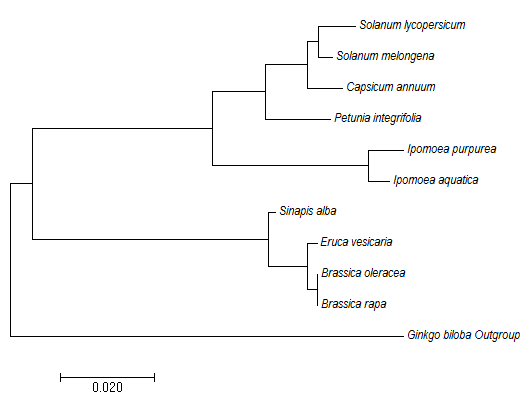

```{r,message=FALSE, warning=FALSE, echo=FALSE, cache=FALSE, fig.height=6, fig.width=7,out.width='100%'}
#Preparing seed set plots, starting with Petunia

#There are 3 crosses were seeds were lost (2,7,9)
#load libraries
library(reshape2)
library(ggplot2)
library(dplyr)
library(gridExtra)
library(grid)
library(lattice)
#read data and cleaning
pein_seed_set <- read.csv("Data/PEIN_seed_set.csv", sep=";")
#removing samples where seeds got lost, first ones of the experiment
pein_seed_set <- pein_seed_set[-c(42,47,49),]

#
##
###
#PETUNIA
###
##
#
#Removing RARA, species not considered because sterility 

pein_seed_set <- filter(pein_seed_set, Treatment!="RARA 100%" & Treatment!="RARA 50%")

#adding the focal species, first 50%
Species <- rep("PEIN", 10)
Treatment <- rep("PEIN 50%", 10)
Treatment.number <- seq(1:10)
Seed.production <- rep(0, 10)
pein_50 <- data.frame(Species,Treatment, Treatment.number, Seed.production,stringsAsFactors = F)
#adding the focal species, 100%
Species <- rep("PEIN", 10)
Treatment <- rep("PEIN 100%", 10)
Treatment.number <- seq(1:10)
Seed.production <- rep(0, 10)
pein_100<-  data.frame(Species,Treatment, Treatment.number, Seed.production,stringsAsFactors = F)
#Order from lower to higher values the average, to plot it nicely
pein_seed_set <- rbind(pein_seed_set, pein_50, pein_100)
pein_seed_set$Treatment<- as.character(pein_seed_set$Treatment)
pein_seed_set <- pein_seed_set[order(pein_seed_set$Treatment),]  
#Organizing with just 50% and cross, self, flower control and control on a side


library(stringr)
pein_seed_set_div <- str_split_fixed(as.character(pein_seed_set$Treatment), " ", 2)
pein_seed_set_div <- data.frame(pein_seed_set_div, stringsAsFactors = F)
colnames(pein_seed_set_div)=c("non_focal","percentage")
pein_seed_set_bind <- cbind(pein_seed_set,pein_seed_set_div)
pein_seed_set_bind <- filter(pein_seed_set_bind, percentage!="100%")
#Because I want to give it specifically order I do it separately
#pein_seed_set_common <- filter(pein_seed_set_bind, non_focal %in% c("CROSS", "SELF","CONTROL","FLOWER"))

pein_seed_set_cross <- filter(pein_seed_set_bind, non_focal %in% c("CROSS"))
pein_seed_set_self <- filter(pein_seed_set_bind, non_focal %in% c("SELF"))
pein_seed_set_control <- filter(pein_seed_set_bind, non_focal %in% c("CONTROL"))
pein_seed_set_flower <- filter(pein_seed_set_bind, non_focal %in% c("FLOWER"))

#Changing 0 for NA'S FOCAL species


# I HAVENT BEEN ABLE TO WORK OUT ALL AT THE SAME TIME SO i DO IOT SEPARATELY
pein_seed_set_bind=pein_seed_set_bind[pein_seed_set_bind$non_focal!=c("CROSS"),]
pein_seed_set_bind=pein_seed_set_bind[pein_seed_set_bind$non_focal!=c("SELF"),]
pein_seed_set_bind=pein_seed_set_bind[pein_seed_set_bind$non_focal!=c("CONTROL"),]
pein_seed_set_bind=pein_seed_set_bind[pein_seed_set_bind$non_focal!=c("FLOWER"),]

pein_seed_set_final<-rbind(pein_seed_set_bind,pein_seed_set_cross, pein_seed_set_self, pein_seed_set_control,
                           pein_seed_set_flower)
#deleting extra columns used for data formating
pein_seed_set_final=pein_seed_set_final[,-c(5,6)]
#adding NA'S to the focal species
pein_seed_set_final[pein_seed_set_final$Treatment==c("PEIN 50%"),4] <- NA
#changing non_focal species name
pein_seed_set_final$Treatment=as.character(pein_seed_set_final$Treatment)
pein_seed_set_final$Family[pein_seed_set_final$Treatment=="BROL 50%"] <- "Brassicaceae"
pein_seed_set_final$Family[pein_seed_set_final$Treatment=="BRRA 50%"] <- "Brassicaceae"
pein_seed_set_final$Family[pein_seed_set_final$Treatment=="SIAL 50%"] <- "Brassicaceae"
pein_seed_set_final$Family[pein_seed_set_final$Treatment=="ERSA 50%"] <- "Brassicaceae"
pein_seed_set_final$Family[pein_seed_set_final$Treatment=="SOME 50%"] <- "Solanaceae"
pein_seed_set_final$Family[pein_seed_set_final$Treatment=="SOLY 50%"] <- "Solanaceae"
pein_seed_set_final$Family[pein_seed_set_final$Treatment=="CAAN 50%"] <- "Solanaceae"
pein_seed_set_final$Family[pein_seed_set_final$Treatment=="PEIN 50%"] <- "Solanaceae"
pein_seed_set_final$Family[pein_seed_set_final$Treatment=="IPPU 50 %"] <- "Convolvulaceae"
pein_seed_set_final$Family[pein_seed_set_final$Treatment=="IPAQ 50%"] <- "Convolvulaceae"

pein_seed_set_final$Treatment[pein_seed_set_final$Treatment=="BROL 50%"] <- "Brassica oleracea"
pein_seed_set_final$Treatment[pein_seed_set_final$Treatment=="BRRA 50%"] <- "Brassica rapa"
pein_seed_set_final$Treatment[pein_seed_set_final$Treatment=="CAAN 50%"] <- "Capsicum annuum"
pein_seed_set_final$Treatment[pein_seed_set_final$Treatment=="ERSA 50%"] <- "Eruca vesicaria" #Eruca sativa seems to be a synonym
pein_seed_set_final$Treatment[pein_seed_set_final$Treatment=="IPAQ 50%"] <- "Ipomoea aquatica"
pein_seed_set_final$Treatment[pein_seed_set_final$Treatment=="IPPU 50 %"] <- "Ipomoea purpurea"
pein_seed_set_final$Treatment[pein_seed_set_final$Treatment=="PEIN 50%"] <- "Petunia integrifolia"
pein_seed_set_final$Treatment[pein_seed_set_final$Treatment=="SIAL 50%"] <- "Sinapis alba"
pein_seed_set_final$Treatment[pein_seed_set_final$Treatment=="SOLY 50%"] <- "Solanum lycopersicum"
pein_seed_set_final$Treatment[pein_seed_set_final$Treatment=="SOME 50%"] <- "Solanum melongena"
pein_seed_set_final$Treatment[pein_seed_set_final$Treatment=="CROSS"] <- "Cross"
pein_seed_set_final$Treatment[pein_seed_set_final$Treatment=="SELF"] <- "Self"
pein_seed_set_final$Treatment[pein_seed_set_final$Treatment=="CONTROL"] <- "Control"
pein_seed_set_final$Treatment[pein_seed_set_final$Treatment=="FLOWER CONTROL"] <- "Flower control"
pein_seed_set_brassicaceae <- filter(pein_seed_set_final, Family %in% c("Brassicaceae"))
pein_seed_set_convolvulaceae <- filter(pein_seed_set_final, Family %in% c("Convolvulaceae"))
pein_seed_set_solanaceae <- filter(pein_seed_set_final, Family %in% c("Solanaceae"))
pein_seed_set_final$Family[is.na(pein_seed_set_final$Family)] <- "Solanum lycopersicum"
pein_seed_set_cross=pein_seed_set_cross[,-c(5,6)]
pein_seed_set_cross$Family <- "other"
pein_seed_set_self=pein_seed_set_self[,-c(5,6)]
pein_seed_set_self$Family <- "other"
pein_seed_set_control=pein_seed_set_control[,-c(5,6)]
pein_seed_set_control$Family <- "other"
pein_seed_set_flower=pein_seed_set_flower[,-c(5,6)]
pein_seed_set_flower$Family <- "other"

pein_seed_set_final=rbind(pein_seed_set_brassicaceae, pein_seed_set_convolvulaceae, 
                          pein_seed_set_solanaceae, pein_seed_set_cross, pein_seed_set_self, pein_seed_set_control,
                          pein_seed_set_flower)

cbPalette <- c( "#56B4E9","#E69F00", "#999999", "#009E73")
#Colur per family

a <- ggplot(pein_seed_set_final, aes(x = factor(Treatment, levels=unique(Treatment)), y = Seed.production)) +   geom_boxplot(outlier.shape = NA)+
  labs(title="Petunia integrifolia",x="", y = "Seeds")+aes(fill=Family)+theme(axis.text.x =element_blank())+
  theme(plot.title = element_text(hjust = 0.5)) +scale_fill_manual(values=cbPalette)+ geom_jitter(width = 0.3,shape=1,size=0.8, aes(colour=Family))+scale_color_manual(values = cbPalette) + stat_summary(fun.y=mean, geom="point", shape="*", size=5) +theme(legend.position="none")


#
##
###
#C. ANNUUM 
###
##
#
caan_seed_set <- read.csv("Data/CAAN_seed_set.csv", sep=";")

#adding the focal species, first 50%
Species <- rep("CAAN", 10)
Treatment <- rep("CAAN 50%", 10)
Treatment.number <- seq(1:10)
Seed.production <- rep(0, 10)
caan_50 <- data.frame(Species,Treatment, Treatment.number, Seed.production)
#adding the focal species, 100%
Species <- rep("CAAN", 10)
Treatment <- rep("CAAN 100%", 10)
Treatment.number <- seq(1:10)
Seed.production <- rep(0, 10)
caan_100<-  data.frame(Species,Treatment, Treatment.number, Seed.production)
#Order from lower to higher values the average, to plot it nicely
caan_seed_set <- caan_seed_set[,-4]
colnames(caan_seed_set)[1] <- "Species"
colnames(caan_seed_set)[2] <- "Treatment"
colnames(caan_seed_set)[3] <- "Treatment.number"
colnames(caan_seed_set)[4] <- "Seed.production"
caan_seed_set <- rbind(caan_seed_set, caan_50, caan_100)
caan_seed_set$Treatment<- as.character(caan_seed_set$Treatment)
caan_seed_set <- caan_seed_set[order(caan_seed_set$Treatment),]  

#Organizing with just 50% and cross, self, flower control and control on a side

library(stringr)
caan_seed_set_div <- str_split_fixed(as.character(caan_seed_set$Treatment), " ", 2)
caan_seed_set_div <- data.frame(caan_seed_set_div, stringsAsFactors = F)
colnames(caan_seed_set_div)=c("non_focal","percentage")
caan_seed_set_bind <- cbind(caan_seed_set,caan_seed_set_div)
caan_seed_set_bind <- filter(caan_seed_set_bind, percentage!="100%")

#Because I want to give it specifically order I do it separately
#pein_seed_set_common <- filter(caan_seed_set_bind, non_focal %in% c("CROSS", "SELF","CONTROL","FLOWER"))

caan_seed_set_cross <- filter(caan_seed_set_bind, non_focal %in% c("CROSS"))
caan_seed_set_self <- filter(caan_seed_set_bind, non_focal %in% c("SELF"))
caan_seed_set_control <- filter(caan_seed_set_bind, non_focal %in% c("CONTROL"))
caan_seed_set_flower <- filter(caan_seed_set_bind, non_focal %in% c("FLOWER"))

#Changing 0 for NA'S FOCAL species


# I HAVENT BEEN ABLE TO WORK OUT ALL AT THE SAME TIME SO i DO IOT SEPARATELY
caan_seed_set_bind=caan_seed_set_bind[caan_seed_set_bind$non_focal!=c("CROSS"),]
caan_seed_set_bind=caan_seed_set_bind[caan_seed_set_bind$non_focal!=c("SELF"),]
caan_seed_set_bind=caan_seed_set_bind[caan_seed_set_bind$non_focal!=c("CONTROL"),]
caan_seed_set_bind=caan_seed_set_bind[caan_seed_set_bind$non_focal!=c("FLOWER"),]

caan_seed_set_final<-rbind(caan_seed_set_bind,caan_seed_set_cross, caan_seed_set_self, caan_seed_set_control,
                           caan_seed_set_flower)
#deleting extra columns used for data formating
caan_seed_set_final=caan_seed_set_final[,-c(5,6)]
#adding NA'S to the focal species
caan_seed_set_final[caan_seed_set_final$Treatment==c("CAAN 50%"),4] <- NA

#changing non_focal species name
caan_seed_set_final$Treatment=as.character(caan_seed_set_final$Treatment)
caan_seed_set_final$Family[caan_seed_set_final$Treatment=="BROL 50%"] <- "Brassicaceae"
caan_seed_set_final$Family[caan_seed_set_final$Treatment=="BRRA 50%"] <- "Brassicaceae"
caan_seed_set_final$Family[caan_seed_set_final$Treatment=="SIAL 50%"] <- "Brassicaceae"
caan_seed_set_final$Family[caan_seed_set_final$Treatment=="ERSA 50%"] <- "Brassicaceae"
caan_seed_set_final$Family[caan_seed_set_final$Treatment=="SOME 50%"] <- "Solanaceae"
caan_seed_set_final$Family[caan_seed_set_final$Treatment=="SOLY 50%"] <- "Solanaceae"
caan_seed_set_final$Family[caan_seed_set_final$Treatment=="CAAN 50%"] <- "Solanaceae"
caan_seed_set_final$Family[caan_seed_set_final$Treatment=="PEIN 50%"] <- "Solanaceae"
caan_seed_set_final$Family[caan_seed_set_final$Treatment=="IPPU 50%"] <- "Convolvulaceae"
caan_seed_set_final$Family[caan_seed_set_final$Treatment=="IPAQ 50%"] <- "Convolvulaceae"

caan_seed_set_final$Treatment[caan_seed_set_final$Treatment=="BROL 50%"] <- "Brassica oleracea"
caan_seed_set_final$Treatment[caan_seed_set_final$Treatment=="BRRA 50%"] <- "Brassica rapa"
caan_seed_set_final$Treatment[caan_seed_set_final$Treatment=="CAAN 50%"] <- "Capsicum annuum"
caan_seed_set_final$Treatment[caan_seed_set_final$Treatment=="ERSA 50%"] <- "Eruca vesicaria" #Eruca sativa seems to be a synonym
caan_seed_set_final$Treatment[caan_seed_set_final$Treatment=="IPAQ 50%"] <- "Ipomoea aquatica"
caan_seed_set_final$Treatment[caan_seed_set_final$Treatment=="IPPU 50%"] <- "Ipomoea purpurea"
caan_seed_set_final$Treatment[caan_seed_set_final$Treatment=="PEIN 50%"] <- "Petunia integrifolia"
caan_seed_set_final$Treatment[caan_seed_set_final$Treatment=="SIAL 50%"] <- "Sinapis alba"
caan_seed_set_final$Treatment[caan_seed_set_final$Treatment=="SOLY 50%"] <- "Solanum lycopersicum"
caan_seed_set_final$Treatment[caan_seed_set_final$Treatment=="SOME 50%"] <- "Solanum melongena"
caan_seed_set_final$Treatment[caan_seed_set_final$Treatment=="CROSS"] <- "Cross"
caan_seed_set_final$Treatment[caan_seed_set_final$Treatment=="SELF"] <- "Self"
caan_seed_set_final$Treatment[caan_seed_set_final$Treatment=="CONTROL"] <- "Control"
caan_seed_set_final$Treatment[caan_seed_set_final$Treatment=="FLOWER CONTROL"] <- "Flower control"

caan_seed_set_brassicaceae <- filter(caan_seed_set_final, Family %in% c("Brassicaceae"))
caan_seed_set_convolvulaceae <- filter(caan_seed_set_final, Family %in% c("Convolvulaceae"))
caan_seed_set_solanaceae <- filter(caan_seed_set_final, Family %in% c("Solanaceae"))
caan_seed_set_final$Family[is.na(caan_seed_set_final$Family)] <- "Solanum lycopersicum"
caan_seed_set_cross=caan_seed_set_cross[,-c(5,6)]
caan_seed_set_cross$Family <- "other"
caan_seed_set_self=caan_seed_set_self[,-c(5,6)]
caan_seed_set_self$Family <- "other"
caan_seed_set_control=caan_seed_set_control[,-c(5,6)]
caan_seed_set_control$Family <- "other"
caan_seed_set_flower=caan_seed_set_flower[,-c(5,6)]
caan_seed_set_flower$Family <- "other"

caan_seed_set_final=rbind(caan_seed_set_brassicaceae, caan_seed_set_convolvulaceae, 
                          caan_seed_set_solanaceae, caan_seed_set_cross, caan_seed_set_self, caan_seed_set_control,
                          caan_seed_set_flower)

cbPalette <- c( "#56B4E9","#E69F00", "#999999", "#009E73")
#Colur per family
#Different colour per family
b <- ggplot(caan_seed_set_final, aes(x = factor(Treatment, levels=unique(Treatment)), y = Seed.production)) +   geom_boxplot(outlier.shape = NA)+
  labs(title="Capsicum annuum",x="", y = "Seeds")+aes(fill=Family)+theme(axis.text.x =element_blank())+
  theme(plot.title = element_text(hjust = 0.5)) +scale_fill_manual(values=cbPalette)+ geom_jitter(width = 0.3,shape=1,size=0.8, aes(colour=Family))+scale_color_manual(values = cbPalette) + stat_summary(fun.y=mean, geom="point", shape="*", size=5) +theme(legend.position="none")


#
##
###
#S. LYCOPERSICUM
###
##
#


soly_seed_set <- read.csv("Data/SOLY_seed_set.csv", sep=";")
soly_seed_set <- filter(soly_seed_set, Treatment!="RARA 100%" & Treatment!="RARA 50%"& Treatment!="COSA 50%"& Treatment!="COSA 100%" )

#adding the focal species, first 50%
Species <- rep("SOLY", 10)
Treatment <- rep("SOLY 50%", 10)
Treatment.number <- seq(1:10)
Seed.production <- rep(0, 10)
soly_50 <- data.frame(Species,Treatment, Treatment.number, Seed.production)
#adding the focal species, 100%
Species <- rep("SOLY", 10)
Treatment <- rep("SOLY 100%", 10)
Treatment.number <- seq(1:10)
Seed.production <- rep(0, 10)
soly_100<-  data.frame(Species,Treatment, Treatment.number, Seed.production)
#Order from lower to higher values the average, to plot it nicely
soly_seed_set <- soly_seed_set[,-4]
colnames(soly_seed_set)[1] <- "Species"
colnames(soly_seed_set)[2] <- "Treatment"
colnames(soly_seed_set)[3] <- "Treatment.number"
colnames(soly_seed_set)[4] <- "Seed.production"
soly_seed_set <- rbind(soly_seed_set, soly_50, soly_100)
soly_seed_set$Treatment<- as.character(soly_seed_set$Treatment)
soly_seed_set <- soly_seed_set[order(soly_seed_set$Treatment),]  

#Organizing with just 50% and cross, self, flower control and control on a side

library(stringr)
soly_seed_set_div <- str_split_fixed(as.character(soly_seed_set$Treatment), " ", 2)
soly_seed_set_div <- data.frame(soly_seed_set_div, stringsAsFactors = F)
colnames(soly_seed_set_div)=c("non_focal","percentage")
soly_seed_set_bind <- cbind(soly_seed_set,soly_seed_set_div)
soly_seed_set_bind <- filter(soly_seed_set_bind, percentage!="100%")

#Because I want to give it specifically order I do it separately
#caan_seed_set_common <- filter(soly_seed_set_bind, non_focal %in% c("CROSS", "SELF","CONTROL","FLOWER"))

soly_seed_set_cross <- filter(soly_seed_set_bind, non_focal %in% c("CROSS"))
soly_seed_set_self <- filter(soly_seed_set_bind, non_focal %in% c("SELF"))
soly_seed_set_control <- filter(soly_seed_set_bind, non_focal %in% c("CONTROL"))
soly_seed_set_flower <- filter(soly_seed_set_bind, non_focal %in% c("FLOWER"))

#Changing 0 for NA'S FOCAL species


# I HAVENT BEEN ABLE TO WORK OUT ALL AT THE SAME TIME SO i DO IOT SEPARATELY
soly_seed_set_bind=soly_seed_set_bind[soly_seed_set_bind$non_focal!=c("CROSS"),]
soly_seed_set_bind=soly_seed_set_bind[soly_seed_set_bind$non_focal!=c("SELF"),]
soly_seed_set_bind=soly_seed_set_bind[soly_seed_set_bind$non_focal!=c("CONTROL"),]
soly_seed_set_bind=soly_seed_set_bind[soly_seed_set_bind$non_focal!=c("FLOWER"),]

soly_seed_set_final<-rbind(soly_seed_set_bind,soly_seed_set_cross, soly_seed_set_self, soly_seed_set_control,
                           soly_seed_set_flower)
#deleting extra columns used for data formating
soly_seed_set_final=soly_seed_set_final[,-c(5,6)]
#adding NA'S to the focal species
soly_seed_set_final[soly_seed_set_final$Treatment==c("SOLY 50%"),4] <- NA

#changing non_focal species name
soly_seed_set_final$Treatment=as.character(soly_seed_set_final$Treatment)
soly_seed_set_final$Family[soly_seed_set_final$Treatment=="BROL 50%"] <- "Brassicaceae"
soly_seed_set_final$Family[soly_seed_set_final$Treatment=="BRRA 50%"] <- "Brassicaceae"
soly_seed_set_final$Family[soly_seed_set_final$Treatment=="SIAL 50%"] <- "Brassicaceae"
soly_seed_set_final$Family[soly_seed_set_final$Treatment=="ERSA 50%"] <- "Brassicaceae"
soly_seed_set_final$Family[soly_seed_set_final$Treatment=="CAAN 50%"] <- "Solanaceae"
soly_seed_set_final$Family[soly_seed_set_final$Treatment=="SOLY 50%"] <- "Solanaceae"
soly_seed_set_final$Family[soly_seed_set_final$Treatment=="SOME 50%"] <- "Solanaceae"
soly_seed_set_final$Family[soly_seed_set_final$Treatment=="PEIN 50%"] <- "Solanaceae"
soly_seed_set_final$Family[soly_seed_set_final$Treatment=="IPPU 50%"] <- "Convolvulaceae"
soly_seed_set_final$Family[soly_seed_set_final$Treatment=="IPAQ 50%"] <- "Convolvulaceae"

soly_seed_set_final$Treatment[soly_seed_set_final$Treatment=="BROL 50%"] <- "Brassica oleracea"
soly_seed_set_final$Treatment[soly_seed_set_final$Treatment=="BRRA 50%"] <- "Brassica rapa"
soly_seed_set_final$Treatment[soly_seed_set_final$Treatment=="CAAN 50%"] <- "Capsicum annuum"
soly_seed_set_final$Treatment[soly_seed_set_final$Treatment=="ERSA 50%"] <- "Eruca vesicaria" #Eruca sativa seems to be a synonym
soly_seed_set_final$Treatment[soly_seed_set_final$Treatment=="IPAQ 50%"] <- "Ipomoea aquatica"
soly_seed_set_final$Treatment[soly_seed_set_final$Treatment=="IPPU 50%"] <- "Ipomoea purpurea"
soly_seed_set_final$Treatment[soly_seed_set_final$Treatment=="PEIN 50%"] <- "Petunia integrifolia"
soly_seed_set_final$Treatment[soly_seed_set_final$Treatment=="SIAL 50%"] <- "Sinapis alba"
soly_seed_set_final$Treatment[soly_seed_set_final$Treatment=="SOLY 50%"] <- "Solanum lycopersicum"
soly_seed_set_final$Treatment[soly_seed_set_final$Treatment=="SOME 50%"] <- "Solanum melongena"


soly_seed_set_brassicaceae <- filter(soly_seed_set_final, Family %in% c("Brassicaceae"))
soly_seed_set_convolvulaceae <- filter(soly_seed_set_final, Family %in% c("Convolvulaceae"))
soly_seed_set_solanaceae <- filter(soly_seed_set_final, Family %in% c("Solanaceae"))
soly_seed_set_final$Family[is.na(soly_seed_set_final$Family)] <- "Solanum lycopersicum"
soly_seed_set_cross=soly_seed_set_cross[,-c(5,6)]
soly_seed_set_cross$Family <- "other"
soly_seed_set_self=soly_seed_set_self[,-c(5,6)]
soly_seed_set_self$Family <- "other"
soly_seed_set_control=soly_seed_set_control[,-c(5,6)]
soly_seed_set_control$Family <- "other"
soly_seed_set_flower=soly_seed_set_flower[,-c(5,6)]
soly_seed_set_flower$Family <- "other"

soly_seed_set_final=rbind(soly_seed_set_brassicaceae, soly_seed_set_convolvulaceae, 
                          soly_seed_set_solanaceae, soly_seed_set_cross, soly_seed_set_self, soly_seed_set_control,
                          soly_seed_set_flower)
soly_seed_set_final$Treatment[soly_seed_set_final$Treatment=="CROSS"] <- "Cross"
soly_seed_set_final$Treatment[soly_seed_set_final$Treatment=="SELF"] <- "Self"
soly_seed_set_final$Treatment[soly_seed_set_final$Treatment=="CONTROL"] <- "Control"
soly_seed_set_final$Treatment[soly_seed_set_final$Treatment=="FLOWER CONTROL"] <- "Flower control"


cbPalette <- c( "#56B4E9","#E69F00", "#999999", "#009E73")
#Different colour per family
c <- ggplot(soly_seed_set_final, aes(x = factor(Treatment, levels=unique(Treatment)), y = Seed.production)) +   geom_boxplot(outlier.shape = NA)+
  labs(title="Solanum lycopersicum",x="", y = "Seeds")+aes(fill=Family)+theme(axis.text.x = element_text(angle = 60, hjust = 1))+
  theme(plot.title = element_text(hjust = 0.5)) +scale_fill_manual(values=cbPalette)+ geom_jitter(width = 0.3,shape=1,size=0.8, aes(colour=Family))+scale_color_manual(values = cbPalette) + stat_summary(fun.y=mean, geom="point", shape="*", size=5) +theme(legend.position="none")


#
##
###
#S. MELONGENA
###
##
#

#Taking out species that weren't used
some_seed_set <- read.csv("Data/SOME_seed_set.csv", sep=";")
some_seed_set <- filter(some_seed_set, Treatment!="RARA 100%" & Treatment!="RARA 50%" & Treatment!="COSA 50%" & Treatment!="COSA 100%")

#adding the focal species, first 50%
Species <- rep("SOME", 10)
Treatment <- rep("SOME 50%", 10)
Treatment.number <- seq(1:10)
Seed.production <- rep(0, 10)
some_50 <- data.frame(Species,Treatment, Treatment.number, Seed.production)
#adding the focal species, 100%
Species <- rep("SOME", 10)
Treatment <- rep("SOME 100%", 10)
Treatment.number <- seq(1:10)
Seed.production <- rep(0, 10)
some_100<-  data.frame(Species,Treatment, Treatment.number, Seed.production)
#Order from lower to higher values the average, to plot it nicely
some_seed_set<- some_seed_set[,-3]
colnames(some_seed_set)[3] <- "Treatment.number"
colnames(some_seed_set)[4] <- "Seed.production"
some_seed_set <- rbind(some_seed_set, some_50, some_100)
some_seed_set$Treatment<- as.character(some_seed_set$Treatment)
some_seed_set <- some_seed_set[order(some_seed_set$Treatment),]  

#Organizing with just 50% and cross, self, flower control and control on a side

library(stringr)
some_seed_set_div <- str_split_fixed(as.character(some_seed_set$Treatment), " ", 2)
some_seed_set_div <- data.frame(some_seed_set_div, stringsAsFactors = F)
colnames(some_seed_set_div)=c("non_focal","percentage")
some_seed_set_bind <- cbind(some_seed_set,some_seed_set_div)
some_seed_set_bind <- filter(some_seed_set_bind, percentage!="100%")

#Because I want to give it specifically order I do it separately
#pein_seed_set_common <- filter(some_seed_set_bind, non_focal %in% c("CROSS", "SELF","CONTROL","FLOWER"))

some_seed_set_cross <- filter(some_seed_set_bind, non_focal %in% c("CROSS"))
some_seed_set_self <- filter(some_seed_set_bind, non_focal %in% c("SELF"))
some_seed_set_control <- filter(some_seed_set_bind, non_focal %in% c("CONTROL"))
some_seed_set_flower <- filter(some_seed_set_bind, non_focal %in% c("FLOWER"))

#Changing 0 for NA'S FOCAL species


# I HAVENT BEEN ABLE TO WORK OUT ALL AT THE SAME TIME SO i DO IOT SEPARATELY
some_seed_set_bind=some_seed_set_bind[some_seed_set_bind$non_focal!=c("CROSS"),]
some_seed_set_bind=some_seed_set_bind[some_seed_set_bind$non_focal!=c("SELF"),]
some_seed_set_bind=some_seed_set_bind[some_seed_set_bind$non_focal!=c("CONTROL"),]
some_seed_set_bind=some_seed_set_bind[some_seed_set_bind$non_focal!=c("FLOWER"),]

some_seed_set_final<-rbind(some_seed_set_bind,some_seed_set_cross, some_seed_set_self, some_seed_set_control,
                           some_seed_set_flower)
#deleting extra columns used for data formating
some_seed_set_final=some_seed_set_final[,-c(5,6)]
#adding NA'S to the focal species
some_seed_set_final[some_seed_set_final$Treatment==c("SOME 50%"),4] <- NA

#changing non_focal species name
some_seed_set_final$Treatment=as.character(some_seed_set_final$Treatment)
some_seed_set_final$Family[some_seed_set_final$Treatment=="BROL 50%"] <- "Brassicaceae"
some_seed_set_final$Family[some_seed_set_final$Treatment=="BRRA 50%"] <- "Brassicaceae"
some_seed_set_final$Family[some_seed_set_final$Treatment=="SIAL 50%"] <- "Brassicaceae"
some_seed_set_final$Family[some_seed_set_final$Treatment=="ERSA 50%"] <- "Brassicaceae"
some_seed_set_final$Family[some_seed_set_final$Treatment=="SOME 50%"] <- "Solanaceae"
some_seed_set_final$Family[some_seed_set_final$Treatment=="SOLY 50%"] <- "Solanaceae"
some_seed_set_final$Family[some_seed_set_final$Treatment=="CAAN 50%"] <- "Solanaceae"
some_seed_set_final$Family[some_seed_set_final$Treatment=="PEIN 50%"] <- "Solanaceae"
some_seed_set_final$Family[some_seed_set_final$Treatment=="IPPU 50%"] <- "Convolvulaceae"
some_seed_set_final$Family[some_seed_set_final$Treatment=="IPAQ 50%"] <- "Convolvulaceae"

some_seed_set_final$Treatment[some_seed_set_final$Treatment=="BROL 50%"] <- "Brassica oleracea"
some_seed_set_final$Treatment[some_seed_set_final$Treatment=="BRRA 50%"] <- "Brassica rapa"
some_seed_set_final$Treatment[some_seed_set_final$Treatment=="CAAN 50%"] <- "Capsicum annuum"
some_seed_set_final$Treatment[some_seed_set_final$Treatment=="ERSA 50%"] <- "Eruca vesicaria" #Eruca sativa seems to be a synonym
some_seed_set_final$Treatment[some_seed_set_final$Treatment=="IPAQ 50%"] <- "Ipomoea aquatica"
some_seed_set_final$Treatment[some_seed_set_final$Treatment=="IPPU 50%"] <- "Ipomoea purpurea"
some_seed_set_final$Treatment[some_seed_set_final$Treatment=="PEIN 50%"] <- "Petunia integrifolia"
some_seed_set_final$Treatment[some_seed_set_final$Treatment=="SIAL 50%"] <- "Sinapis alba"
some_seed_set_final$Treatment[some_seed_set_final$Treatment=="SOLY 50%"] <- "Solanum lycopersicum"
some_seed_set_final$Treatment[some_seed_set_final$Treatment=="SOME 50%"] <- "Solanum melongena"
some_seed_set_final$Treatment[some_seed_set_final$Treatment=="CROSS"] <- "Cross"
some_seed_set_final$Treatment[some_seed_set_final$Treatment=="SELF"] <- "Self"
some_seed_set_final$Treatment[some_seed_set_final$Treatment=="CONTROL"] <- "Control"
some_seed_set_final$Treatment[some_seed_set_final$Treatment=="FLOWER CONTROL"] <- "Flower control"

some_seed_set_brassicaceae <- filter(some_seed_set_final, Family %in% c("Brassicaceae"))
some_seed_set_convolvulaceae <- filter(some_seed_set_final, Family %in% c("Convolvulaceae"))
some_seed_set_solanaceae <- filter(some_seed_set_final, Family %in% c("Solanaceae"))
some_seed_set_final$Family[is.na(some_seed_set_final$Family)] <- "Solanum lycopersicum"
some_seed_set_cross=some_seed_set_cross[,-c(5,6)]
some_seed_set_cross$Family <- "other"
some_seed_set_self=some_seed_set_self[,-c(5,6)]
some_seed_set_self$Family <- "other"
some_seed_set_control=some_seed_set_control[,-c(5,6)]
some_seed_set_control$Family <- "other"
some_seed_set_flower=some_seed_set_flower[,-c(5,6)]
some_seed_set_flower$Family <- "other"

some_seed_set_final=rbind(some_seed_set_brassicaceae, some_seed_set_convolvulaceae, 
                          some_seed_set_solanaceae, some_seed_set_cross, some_seed_set_self, some_seed_set_control,
                          some_seed_set_flower)
some_seed_set_final$Treatment[some_seed_set_final$Treatment=="CROSS"] <- "Cross"
some_seed_set_final$Treatment[some_seed_set_final$Treatment=="SELF"] <- "Self"
some_seed_set_final$Treatment[some_seed_set_final$Treatment=="CONTROL"] <- "Control"
some_seed_set_final$Treatment[some_seed_set_final$Treatment=="FLOWER CONTROL"] <- "Flower control"


cbPalette <- c( "#56B4E9","#E69F00", "#999999", "#009E73")
#Different colour per family
d <- ggplot(some_seed_set_final, aes(x = factor(Treatment, levels=unique(Treatment)), y = Seed.production)) +   geom_boxplot(outlier.shape = NA)+
  labs(title="Solanum melongena",x="", y = "Seeds")+aes(fill=Family)+theme(axis.text.x = element_text(angle = 60, hjust = 1))+
  theme(plot.title = element_text(hjust = 0.5)) +scale_fill_manual(values=cbPalette)+ geom_jitter(width = 0.3,shape=1,size=0.8, aes(colour=Family))+scale_color_manual(values = cbPalette) + stat_summary(fun.y=mean, geom="point", shape="*", size=5) +theme(legend.position="none")


gl <- lapply(list(a,b,c,d), ggplotGrob)
library(grid)
widths <- do.call(unit.pmax, lapply(gl, "[[", "widths"))
heights <- do.call(unit.pmax, lapply(gl, "[[", "heights"))
lg <- lapply(gl, function(g) {g$widths <- widths; g$heights <- heights; g})


grobz <- lapply(list(a, b, c, d), ggplotGrob)
grobz.plot <- arrangeGrob( grobs = list(rbind(grobz[[1]], grobz[[3]], size = "last"),
                                        rbind(grobz[[2]], grobz[[4]], size = "last")),
                           ncol = 2, top="Solanaceae Focal Species")

grid.draw(grobz.plot)

```


```{r,message=FALSE, warning=FALSE, echo=FALSE, cache=FALSE, fig.height=6, fig.width=7,out.width='100%'}
library(dplyr)

#load libraries
library(reshape2)
library(ggplot2)
library(dplyr)
library(gridExtra)
library(grid)
library(lattice)
library(gtable)
##
###
#B. OLERACEA
###
##
#


brol_seed_set <- read.csv("Data/BROL_seed_set.csv", sep=";")
brol_seed_set <- filter(brol_seed_set, Treatment!="RARA 100%" & Treatment!="RARA 50%"& Treatment!="COSA 50%"& Treatment!="COSA 100%" )

#adding the focal species, first 50%
Species <- rep("BROL", 10)
Treatment <- rep("BROL 50%", 10)
Treatment.number <- seq(1:10)
Seed.production <- rep(0, 10)
brol_50 <- data.frame(Species,Treatment, Treatment.number, Seed.production)
#adding the focal species, 100%
Species <- rep("BROL", 10)
Treatment <- rep("BROL 100%", 10)
Treatment.number <- seq(1:10)
Seed.production <- rep(0, 10)
brol_100<-  data.frame(Species,Treatment, Treatment.number, Seed.production)
#Order from lower to higher values the average, to plot it nicely
colnames(brol_seed_set)[1] <- "Species"
colnames(brol_seed_set)[2] <- "Treatment"
colnames(brol_seed_set)[3] <- "Treatment.number"
colnames(brol_seed_set)[4] <- "Seed.production"
brol_seed_set <- rbind(brol_seed_set, brol_50, brol_100)
brol_seed_set$Treatment<- as.character(brol_seed_set$Treatment)
brol_seed_set <- brol_seed_set[order(brol_seed_set$Treatment),]  

#Organizing with just 50% and cross, self, flower control and control on a side

library(stringr)
brol_seed_set_div <- str_split_fixed(as.character(brol_seed_set$Treatment), " ", 2)
brol_seed_set_div <- data.frame(brol_seed_set_div, stringsAsFactors = F)
colnames(brol_seed_set_div)=c("non_focal","percentage")
brol_seed_set_bind <- cbind(brol_seed_set,brol_seed_set_div)
brol_seed_set_bind <- filter(brol_seed_set_bind, percentage!="100%")

#Because I want to give it specifically order I do it separately
#pein_seed_set_common <- filter(brol_seed_set_bind, non_focal %in% c("CROSS", "SELF","CONTROL","FLOWER"))

brol_seed_set_cross <- filter(brol_seed_set_bind, non_focal %in% c("Cross"))
brol_seed_set_self <- filter(brol_seed_set_bind, non_focal %in% c("Self"))
brol_seed_set_control <- filter(brol_seed_set_bind, non_focal %in% c("Control"))
brol_seed_set_flower <- filter(brol_seed_set_bind, non_focal %in% c("FC"))

#Changing 0 for NA'S FOCAL species


# I HAVENT BEEN ABLE TO WORK OUT ALL AT THE SAME TIME SO i DO IOT SEPARATELY
brol_seed_set_bind=brol_seed_set_bind[brol_seed_set_bind$non_focal!=c("Cross"),]
brol_seed_set_bind=brol_seed_set_bind[brol_seed_set_bind$non_focal!=c("Self"),]
brol_seed_set_bind=brol_seed_set_bind[brol_seed_set_bind$non_focal!=c("Control"),]
brol_seed_set_bind=brol_seed_set_bind[brol_seed_set_bind$non_focal!=c("FC"),]

brol_seed_set_final<-rbind(brol_seed_set_bind,brol_seed_set_cross, brol_seed_set_self, brol_seed_set_control,
                           brol_seed_set_flower)
#deleting extra columns used for data formating
brol_seed_set_final=brol_seed_set_final[,-c(5,6)]
#adding NA'S to the focal species
brol_seed_set_final[brol_seed_set_final$Treatment==c("BROL 50%"),4] <- NA

#changing non_focal species name
brol_seed_set_final$Treatment=as.character(brol_seed_set_final$Treatment)
brol_seed_set_final$Family[brol_seed_set_final$Treatment=="BROL 50%"] <- "Brassicaceae"
brol_seed_set_final$Family[brol_seed_set_final$Treatment=="BRRA 50%"] <- "Brassicaceae"
brol_seed_set_final$Family[brol_seed_set_final$Treatment=="SIAL 50%"] <- "Brassicaceae"
brol_seed_set_final$Family[brol_seed_set_final$Treatment=="ERSA 50%"] <- "Brassicaceae"
brol_seed_set_final$Family[brol_seed_set_final$Treatment=="CAAN 50%"] <- "Solanaceae"
brol_seed_set_final$Family[brol_seed_set_final$Treatment=="SOLY 50%"] <- "Solanaceae"
brol_seed_set_final$Family[brol_seed_set_final$Treatment=="SOME 50%"] <- "Solanaceae"
brol_seed_set_final$Family[brol_seed_set_final$Treatment=="PEIN 50%"] <- "Solanaceae"
brol_seed_set_final$Family[brol_seed_set_final$Treatment=="IPPU 50%"] <- "Convolvulaceae"
brol_seed_set_final$Family[brol_seed_set_final$Treatment=="IPAQ 50%"] <- "Convolvulaceae"

brol_seed_set_final$Treatment[brol_seed_set_final$Treatment=="BROL 50%"] <- "Brassica oleracea"
brol_seed_set_final$Treatment[brol_seed_set_final$Treatment=="BRRA 50%"] <- "Brassica rapa"
brol_seed_set_final$Treatment[brol_seed_set_final$Treatment=="CAAN 50%"] <- "Capsicum annuum"
brol_seed_set_final$Treatment[brol_seed_set_final$Treatment=="ERSA 50%"] <- "Eruca vesicaria" #Eruca sativa seems to be a synonym
brol_seed_set_final$Treatment[brol_seed_set_final$Treatment=="IPAQ 50%"] <- "Ipomoea aquatica"
brol_seed_set_final$Treatment[brol_seed_set_final$Treatment=="IPPU 50%"] <- "Ipomoea purpurea"
brol_seed_set_final$Treatment[brol_seed_set_final$Treatment=="PEIN 50%"] <- "Petunia integrifolia"
brol_seed_set_final$Treatment[brol_seed_set_final$Treatment=="SIAL 50%"] <- "Sinapis alba"
brol_seed_set_final$Treatment[brol_seed_set_final$Treatment=="SOLY 50%"] <- "Solanum lycopersicum"
brol_seed_set_final$Treatment[brol_seed_set_final$Treatment=="SOME 50%"] <- "Solanum melongena"
brol_seed_set_final$Treatment[brol_seed_set_final$Treatment=="FC"] <- "Flower control"

#Different colour per family
a <- ggplot(brol_seed_set_final, aes(x = factor(Treatment, levels=unique(Treatment)), y = Seed.production)) +   geom_boxplot(outlier.shape = NA)+
  labs(title="Brassica oleracea",x="", y = "Seeds")+aes(fill=Family)+theme(axis.text.x = element_blank())+
  theme(plot.title = element_text(hjust = 0.5)) + geom_jitter(width = 0.3,shape=1,size=0.8, aes(colour=Family)) + stat_summary(fun.y=mean, geom="point", shape="*", size=5, colour="black") +theme(legend.position="none")

#
##
###
#B. RAPA
###
##
#


brra_seed_set <- read.csv("Data/BRRA_seed_set.csv", sep=";")
brra_seed_set <- filter(brra_seed_set, Treatment!="RARA 100%" & Treatment!="RARA 50%"& Treatment!="COSA 50%"& Treatment!="COSA 100%" )

#adding the focal species, first 50%
Species <- rep("BRRA", 10)
Treatment <- rep("BRRA 50%", 10)
Treatment.number <- seq(1:10)
Seed.production <- rep(0, 10)
brra_50 <- data.frame(Species,Treatment, Treatment.number, Seed.production)
#adding the focal species, 100%
Species <- rep("BRRA", 10)
Treatment <- rep("BRRA 100%", 10)
Treatment.number <- seq(1:10)
Seed.production <- rep(0, 10)
brra_100<-  data.frame(Species,Treatment, Treatment.number, Seed.production)
#Order from lower to higher values the average, to plot it nicely
colnames(brra_seed_set)[1] <- "Species"
colnames(brra_seed_set)[2] <- "Treatment"
colnames(brra_seed_set)[3] <- "Treatment.number"
colnames(brra_seed_set)[4] <- "Seed.production"
brra_seed_set <- rbind(brra_seed_set, brra_50, brra_100)
brra_seed_set$Treatment<- as.character(brra_seed_set$Treatment)
brra_seed_set <- brra_seed_set[order(brra_seed_set$Treatment),]  

#Organizing with just 50% and cross, self, flower control and control on a side

library(stringr)
brra_seed_set_div <- str_split_fixed(as.character(brra_seed_set$Treatment), " ", 2)
brra_seed_set_div <- data.frame(brra_seed_set_div, stringsAsFactors = F)
colnames(brra_seed_set_div)=c("non_focal","percentage")
brra_seed_set_bind <- cbind(brra_seed_set,brra_seed_set_div)
brra_seed_set_bind <- filter(brra_seed_set_bind, percentage!="100%")

#Because I want to give it specifically order I do it separately
#pein_seed_set_common <- filter(brra_seed_set_bind, non_focal %in% c("CROSS", "SELF","CONTROL","FLOWER"))

brra_seed_set_cross <- filter(brra_seed_set_bind, non_focal %in% c("Cross"))
brra_seed_set_self <- filter(brra_seed_set_bind, non_focal %in% c("Self"))
brra_seed_set_control <- filter(brra_seed_set_bind, non_focal %in% c("Control"))
brra_seed_set_flower <- filter(brra_seed_set_bind, non_focal %in% c("Flower"))

#Changing 0 for NA'S FOCAL species


# I HAVENT BEEN ABLE TO WORK OUT ALL AT THE SAME TIME SO i DO IOT SEPARATELY
brra_seed_set_bind=brra_seed_set_bind[brra_seed_set_bind$non_focal!=c("Cross"),]
brra_seed_set_bind=brra_seed_set_bind[brra_seed_set_bind$non_focal!=c("Self"),]
brra_seed_set_bind=brra_seed_set_bind[brra_seed_set_bind$non_focal!=c("Control"),]
brra_seed_set_bind=brra_seed_set_bind[brra_seed_set_bind$non_focal!=c("Flower"),]

brra_seed_set_final<-rbind(brra_seed_set_bind,brra_seed_set_cross, brra_seed_set_self, brra_seed_set_control,
                           brra_seed_set_flower)
#deleting extra columns used for data formating
brra_seed_set_final=brra_seed_set_final[,-c(5,6)]
#adding NA'S to the focal species
brra_seed_set_final[brra_seed_set_final$Treatment==c("BRRA 50%"),4] <- NA

#changing non_focal species name
brra_seed_set_final$Treatment=as.character(brra_seed_set_final$Treatment)
brra_seed_set_final$Family[brra_seed_set_final$Treatment=="BROL 50%"] <- "Brassicaceae"
brra_seed_set_final$Family[brra_seed_set_final$Treatment=="BRRA 50%"] <- "Brassicaceae"
brra_seed_set_final$Family[brra_seed_set_final$Treatment=="SIAL 50%"] <- "Brassicaceae"
brra_seed_set_final$Family[brra_seed_set_final$Treatment=="ERSA 50%"] <- "Brassicaceae"
brra_seed_set_final$Family[brra_seed_set_final$Treatment=="CAAN 50%"] <- "Solanaceae"
brra_seed_set_final$Family[brra_seed_set_final$Treatment=="SOLY 50%"] <- "Solanaceae"
brra_seed_set_final$Family[brra_seed_set_final$Treatment=="SOME 50%"] <- "Solanaceae"
brra_seed_set_final$Family[brra_seed_set_final$Treatment=="PEIN 50%"] <- "Solanaceae"
brra_seed_set_final$Family[brra_seed_set_final$Treatment=="IPPU 50%"] <- "Convolvulaceae"
brra_seed_set_final$Family[brra_seed_set_final$Treatment=="IPAQ 50%"] <- "Convolvulaceae"

brra_seed_set_final$Treatment[brra_seed_set_final$Treatment=="BROL 50%"] <- "Brassica oleracea"
brra_seed_set_final$Treatment[brra_seed_set_final$Treatment=="BRRA 50%"] <- "Brassica rapa"
brra_seed_set_final$Treatment[brra_seed_set_final$Treatment=="CAAN 50%"] <- "Capsicum annuum"
brra_seed_set_final$Treatment[brra_seed_set_final$Treatment=="ERSA 50%"] <- "Eruca vesicaria" #Eruca sativa seems to be a synonym
brra_seed_set_final$Treatment[brra_seed_set_final$Treatment=="IPAQ 50%"] <- "Ipomoea aquatica"
brra_seed_set_final$Treatment[brra_seed_set_final$Treatment=="IPPU 50%"] <- "Ipomoea purpurea"
brra_seed_set_final$Treatment[brra_seed_set_final$Treatment=="PEIN 50%"] <- "Petunia integrifolia"
brra_seed_set_final$Treatment[brra_seed_set_final$Treatment=="SIAL 50%"] <- "Sinapis alba"
brra_seed_set_final$Treatment[brra_seed_set_final$Treatment=="SOLY 50%"] <- "Solanum lycopersicum"
brra_seed_set_final$Treatment[brra_seed_set_final$Treatment=="SOME 50%"] <- "Solanum melongena"
brra_seed_set_final$Treatment[brra_seed_set_final$Treatment=="FC"] <- "Flower control"

#Different colour per family
b <- ggplot(brra_seed_set_final, aes(x = factor(Treatment, levels=unique(Treatment)), y = Seed.production)) +   geom_boxplot(outlier.shape = NA)+
  labs(title="Brassica rapa",x="", y = "")+aes(fill=Family)+theme(axis.text.x = element_blank())+
  theme(plot.title = element_text(hjust = 0.5)) + geom_jitter(width = 0.3,shape=1,size=0.8, aes(colour=Family)) + stat_summary(fun.y=mean, geom="point", shape="*", size=5, colour="black") +theme(legend.position="none")

#
##
###
#E. VERSICARIA
###
##
#


ersa_seed_set <- read.csv("Data/ersa_seed_set.csv", sep=";")
ersa_seed_set <- filter(ersa_seed_set, Treatment!="RARA 100%" & Treatment!="RARA 50%"& Treatment!="COSA 50%"& Treatment!="COSA 100%" )

#adding the focal species, first 50%
Species <- rep("ERSA", 10)
Treatment <- rep("ERSA 50%", 10)
Treatment.number <- seq(1:10)
Seed.production <- rep(0, 10)
ersa_50 <- data.frame(Species,Treatment, Treatment.number, Seed.production)
#adding the focal species, 100%
Species <- rep("ERSA", 10)
Treatment <- rep("ERSA 100%", 10)
Treatment.number <- seq(1:10)
Seed.production <- rep(0, 10)
ersa_100<-  data.frame(Species,Treatment, Treatment.number, Seed.production)
#Order from lower to higher values the average, to plot it nicely
colnames(ersa_seed_set)[1] <- "Species"
colnames(ersa_seed_set)[2] <- "Treatment"
colnames(ersa_seed_set)[3] <- "Treatment.number"
colnames(ersa_seed_set)[4] <- "Seed.production"
ersa_seed_set <- rbind(ersa_seed_set, ersa_50, ersa_100)
ersa_seed_set$Treatment<- as.character(ersa_seed_set$Treatment)
ersa_seed_set <- ersa_seed_set[order(ersa_seed_set$Treatment),]  

#Organizing with just 50% and cross, self, flower control and control on a side

library(stringr)
ersa_seed_set_div <- str_split_fixed(as.character(ersa_seed_set$Treatment), " ", 2)
ersa_seed_set_div <- data.frame(ersa_seed_set_div, stringsAsFactors = F)
colnames(ersa_seed_set_div)=c("non_focal","percentage")
ersa_seed_set_bind <- cbind(ersa_seed_set,ersa_seed_set_div)
ersa_seed_set_bind <- filter(ersa_seed_set_bind, percentage!="100%")

#Because I want to give it specifically order I do it separately
#pein_seed_set_common <- filter(ersa_seed_set_bind, non_focal %in% c("CROSS", "SELF","CONTROL","FLOWER"))

ersa_seed_set_cross <- filter(ersa_seed_set_bind, non_focal %in% c("Cross"))
ersa_seed_set_self <- filter(ersa_seed_set_bind, non_focal %in% c("Self"))
ersa_seed_set_control <- filter(ersa_seed_set_bind, non_focal %in% c("Control"))
ersa_seed_set_flower <- filter(ersa_seed_set_bind, non_focal %in% c("Flower"))

#Changing 0 for NA'S FOCAL species


# I HAVENT BEEN ABLE TO WORK OUT ALL AT THE SAME TIME SO i DO IOT SEPARATELY
ersa_seed_set_bind=ersa_seed_set_bind[ersa_seed_set_bind$non_focal!=c("Cross"),]
ersa_seed_set_bind=ersa_seed_set_bind[ersa_seed_set_bind$non_focal!=c("Self"),]
ersa_seed_set_bind=ersa_seed_set_bind[ersa_seed_set_bind$non_focal!=c("Control"),]
ersa_seed_set_bind=ersa_seed_set_bind[ersa_seed_set_bind$non_focal!=c("Flower"),]

ersa_seed_set_final<-rbind(ersa_seed_set_bind,ersa_seed_set_cross, ersa_seed_set_self, ersa_seed_set_control,
                           ersa_seed_set_flower)
#deleting extra columns used for data formating
ersa_seed_set_final=ersa_seed_set_final[,-c(5,6)]
#adding NA'S to the focal species
ersa_seed_set_final[ersa_seed_set_final$Treatment==c("ERSA 50%"),4] <- NA

#changing non_focal species name
ersa_seed_set_final$Treatment=as.character(ersa_seed_set_final$Treatment)
ersa_seed_set_final$Family[ersa_seed_set_final$Treatment=="BROL 50%"] <- "Brassicaceae"
ersa_seed_set_final$Family[ersa_seed_set_final$Treatment=="BRRA 50%"] <- "Brassicaceae"
ersa_seed_set_final$Family[ersa_seed_set_final$Treatment=="SIAL 50%"] <- "Brassicaceae"
ersa_seed_set_final$Family[ersa_seed_set_final$Treatment=="ERSA 50%"] <- "Brassicaceae"
ersa_seed_set_final$Family[ersa_seed_set_final$Treatment=="CAAN 50%"] <- "Solanaceae"
ersa_seed_set_final$Family[ersa_seed_set_final$Treatment=="SOLY 50%"] <- "Solanaceae"
ersa_seed_set_final$Family[ersa_seed_set_final$Treatment=="SOME 50%"] <- "Solanaceae"
ersa_seed_set_final$Family[ersa_seed_set_final$Treatment=="PEIN 50%"] <- "Solanaceae"
ersa_seed_set_final$Family[ersa_seed_set_final$Treatment=="IPPU 50%"] <- "Convolvulaceae"
ersa_seed_set_final$Family[ersa_seed_set_final$Treatment=="IPAQ 50%"] <- "Convolvulaceae"

ersa_seed_set_final$Treatment[ersa_seed_set_final$Treatment=="BROL 50%"] <- "Brassica oleracea"
ersa_seed_set_final$Treatment[ersa_seed_set_final$Treatment=="BRRA 50%"] <- "Brassica rapa"
ersa_seed_set_final$Treatment[ersa_seed_set_final$Treatment=="CAAN 50%"] <- "Capsicum annuum"
ersa_seed_set_final$Treatment[ersa_seed_set_final$Treatment=="ERSA 50%"] <- "Eruca vesicaria" #Eruca sativa seems to be a synonym
ersa_seed_set_final$Treatment[ersa_seed_set_final$Treatment=="IPAQ 50%"] <- "Ipomoea aquatica"
ersa_seed_set_final$Treatment[ersa_seed_set_final$Treatment=="IPPU 50%"] <- "Ipomoea purpurea"
ersa_seed_set_final$Treatment[ersa_seed_set_final$Treatment=="PEIN 50%"] <- "Petunia integrifolia"
ersa_seed_set_final$Treatment[ersa_seed_set_final$Treatment=="SIAL 50%"] <- "Sinapis alba"
ersa_seed_set_final$Treatment[ersa_seed_set_final$Treatment=="SOLY 50%"] <- "Solanum lycopersicum"
ersa_seed_set_final$Treatment[ersa_seed_set_final$Treatment=="SOME 50%"] <- "Solanum melongena"
ersa_seed_set_final$Treatment[ersa_seed_set_final$Treatment=="FC"] <- "Flower control"

#Different colour per family
c <- ggplot(ersa_seed_set_final, aes(x = factor(Treatment, levels=unique(Treatment)), y = Seed.production)) +   geom_boxplot(outlier.shape = NA)+
  labs(title="Eruca versicaria",x="", y = "Seeds")+aes(fill=Family)+theme(axis.text.x = element_text(angle = 60, hjust = 1))+
  theme(plot.title = element_text(hjust = 0.5)) + geom_jitter(width = 0.3,shape=1,size=0.8, aes(colour=Family)) + stat_summary(fun.y=mean, geom="point", shape="*", size=5, colour="black") +theme(legend.position="none")
#
##
###
#S. ALBA  
###
##
#


sial_seed_set <- read.csv("Data/sial_seed_set.csv", sep=";")
sial_seed_set <- filter(sial_seed_set, Treatment!="RARA 100%" & Treatment!="RARA 50%"& Treatment!="COSA 50%"& Treatment!="COSA 100%" )

#adding the focal species, first 50%
Species <- rep("SIAL", 10)
Treatment <- rep("SIAL 50%", 10)
Treatment.number <- seq(1:10)
Seed.production <- rep(0, 10)
sial_50 <- data.frame(Species,Treatment, Treatment.number, Seed.production)
#adding the focal species, 100%
Species <- rep("SIAL", 10)
Treatment <- rep("SIAL 100%", 10)
Treatment.number <- seq(1:10)
Seed.production <- rep(0, 10)
sial_100<-  data.frame(Species,Treatment, Treatment.number, Seed.production)
#Order from lower to higher values the average, to plot it nicely
colnames(sial_seed_set)[1] <- "Species"
colnames(sial_seed_set)[2] <- "Treatment"
colnames(sial_seed_set)[3] <- "Treatment.number"
colnames(sial_seed_set)[4] <- "Seed.production"
sial_seed_set <- rbind(sial_seed_set, sial_50, sial_100)
sial_seed_set$Treatment<- as.character(sial_seed_set$Treatment)
sial_seed_set <- sial_seed_set[order(sial_seed_set$Treatment),]  

#Organizing with just 50% and cross, self, flower control and control on a side

library(stringr)
sial_seed_set_div <- str_split_fixed(as.character(sial_seed_set$Treatment), " ", 2)
sial_seed_set_div <- data.frame(sial_seed_set_div, stringsAsFactors = F)
colnames(sial_seed_set_div)=c("non_focal","percentage")
sial_seed_set_bind <- cbind(sial_seed_set,sial_seed_set_div)
sial_seed_set_bind <- filter(sial_seed_set_bind, percentage!="100%")

#Because I want to give it specifically order I do it separately
#pein_seed_set_common <- filter(sial_seed_set_bind, non_focal %in% c("CROSS", "SELF","CONTROL","FLOWER"))

sial_seed_set_cross <- filter(sial_seed_set_bind, non_focal %in% c("Cross"))
sial_seed_set_self <- filter(sial_seed_set_bind, non_focal %in% c("Self"))
sial_seed_set_control <- filter(sial_seed_set_bind, non_focal %in% c("Control"))
sial_seed_set_flower <- filter(sial_seed_set_bind, non_focal %in% c("Flower"))

#Changing 0 for NA'S FOCAL species


# I HAVENT BEEN ABLE TO WORK OUT ALL AT THE SAME TIME SO i DO IOT SEPARATELY
sial_seed_set_bind=sial_seed_set_bind[sial_seed_set_bind$non_focal!=c("Cross"),]
sial_seed_set_bind=sial_seed_set_bind[sial_seed_set_bind$non_focal!=c("Self"),]
sial_seed_set_bind=sial_seed_set_bind[sial_seed_set_bind$non_focal!=c("Control"),]
sial_seed_set_bind=sial_seed_set_bind[sial_seed_set_bind$non_focal!=c("Flower"),]

sial_seed_set_final<-rbind(sial_seed_set_bind,sial_seed_set_cross, sial_seed_set_self, sial_seed_set_control,
                           sial_seed_set_flower)
#deleting extra columns used for data formating
sial_seed_set_final=sial_seed_set_final[,-c(5,6)]
#adding NA'S to the focal species
sial_seed_set_final[sial_seed_set_final$Treatment==c("SIAL 50%"),4] <- NA

#changing non_focal species name
sial_seed_set_final$Treatment=as.character(sial_seed_set_final$Treatment)
sial_seed_set_final$Family[sial_seed_set_final$Treatment=="BROL 50%"] <- "Brassicaceae"
sial_seed_set_final$Family[sial_seed_set_final$Treatment=="BRRA 50%"] <- "Brassicaceae"
sial_seed_set_final$Family[sial_seed_set_final$Treatment=="SIAL 50%"] <- "Brassicaceae"
sial_seed_set_final$Family[sial_seed_set_final$Treatment=="ERSA 50%"] <- "Brassicaceae"
sial_seed_set_final$Family[sial_seed_set_final$Treatment=="CAAN 50%"] <- "Solanaceae"
sial_seed_set_final$Family[sial_seed_set_final$Treatment=="SOLY 50%"] <- "Solanaceae"
sial_seed_set_final$Family[sial_seed_set_final$Treatment=="SOME 50%"] <- "Solanaceae"
sial_seed_set_final$Family[sial_seed_set_final$Treatment=="PEIN 50%"] <- "Solanaceae"
sial_seed_set_final$Family[sial_seed_set_final$Treatment=="IPPU 50%"] <- "Convolvulaceae"
sial_seed_set_final$Family[sial_seed_set_final$Treatment=="IPAQ 50%"] <- "Convolvulaceae"

sial_seed_set_final$Treatment[sial_seed_set_final$Treatment=="BROL 50%"] <- "Brassica oleracea"
sial_seed_set_final$Treatment[sial_seed_set_final$Treatment=="BRRA 50%"] <- "Brassica rapa"
sial_seed_set_final$Treatment[sial_seed_set_final$Treatment=="CAAN 50%"] <- "Capsicum annuum"
sial_seed_set_final$Treatment[sial_seed_set_final$Treatment=="ERSA 50%"] <- "Eruca vesicaria" #Eruca sativa seems to be a synonym
sial_seed_set_final$Treatment[sial_seed_set_final$Treatment=="IPAQ 50%"] <- "Ipomoea aquatica"
sial_seed_set_final$Treatment[sial_seed_set_final$Treatment=="IPPU 50%"] <- "Ipomoea purpurea"
sial_seed_set_final$Treatment[sial_seed_set_final$Treatment=="PEIN 50%"] <- "Petunia integrifolia"
sial_seed_set_final$Treatment[sial_seed_set_final$Treatment=="SIAL 50%"] <- "Sinapis alba"
sial_seed_set_final$Treatment[sial_seed_set_final$Treatment=="SOLY 50%"] <- "Solanum lycopersicum"
sial_seed_set_final$Treatment[sial_seed_set_final$Treatment=="SOME 50%"] <- "Solanum melongena"
sial_seed_set_final$Treatment[sial_seed_set_final$Treatment=="FC"] <- "Flower control"

#Different colour per family
d <- ggplot(sial_seed_set_final, aes(x = factor(Treatment, levels=unique(Treatment)), y = Seed.production)) +   geom_boxplot(outlier.shape = NA)+
  labs(title="Sinapis alba",x="", y = "", tag= "D")+aes(fill=Family)+theme(axis.text.x = element_text(angle = 60, hjust = 1))+ theme(plot.title = element_text(hjust = 0.5)) + geom_jitter(width = 0.3,shape=1,size=0.8, aes(colour=Family))+ stat_summary(fun.y=mean, geom="point", shape="*", size=5, colour="black") + theme(legend.position="none")


gl <- lapply(list(a,b,c,d), ggplotGrob)
library(grid)
widths <- do.call(unit.pmax, lapply(gl, "[[", "widths"))
heights <- do.call(unit.pmax, lapply(gl, "[[", "heights"))
lg <- lapply(gl, function(g) {g$widths <- widths; g$heights <- heights; g})


grobz <- lapply(list(a, b, c, d), ggplotGrob)
grobz.plot <- arrangeGrob( grobs = list(rbind(grobz[[1]], grobz[[3]], size = "last"),
                                        rbind(grobz[[2]], grobz[[4]], size = "last")), ncol = 2,top="Brassicaceae Focal species")

grid.draw(grobz.plot)


```
```{r,message=FALSE, warning=FALSE, echo=FALSE, cache=FALSE, fig.height=3.7, fig.width=7,out.width='100%'}


library(reshape2)
library(ggplot2)
library(dplyr)
library(gridExtra)
library(grid)
library(lattice)

#Preparing seed set plots, starting with Petunia
#
##
###
#I. AQUATICA
###
##
#


ipaq_seed_set <- read.csv("Data/ipaq_seed_set.csv", sep=";")
colnames(ipaq_seed_set)[1] <- "Species"
colnames(ipaq_seed_set)[2] <- "Treatment"
colnames(ipaq_seed_set)[3] <- "Treatment.number"
colnames(ipaq_seed_set)[4] <- "Seed.production"

ipaq_seed_set <- filter(ipaq_seed_set, Treatment!="RARA 100%" & Treatment!="RARA 50%"& Treatment!="COSA 50%"& Treatment!="COSA 100%" )

#adding the focal species, first 50%
Species <- rep("IPAQ", 10)
Treatment <- rep("IPAQ 50%", 10)
Treatment.number <- seq(1:10)
Seed.production <- rep(0, 10)
ipaq_50 <- data.frame(Species,Treatment, Treatment.number, Seed.production)
#adding the focal species, 100%
Species <- rep("IPAQ", 10)
Treatment <- rep("IPAQ 100%", 10)
Treatment.number <- seq(1:10)
Seed.production <- rep(0, 10)
ipaq_100<-  data.frame(Species,Treatment, Treatment.number, Seed.production)
#Order from lower to higher values the average, to plot it nicely

ipaq_seed_set <- rbind(ipaq_seed_set, ipaq_50, ipaq_100)
ipaq_seed_set$Treatment<- as.character(ipaq_seed_set$Treatment)
ipaq_seed_set <- ipaq_seed_set[order(ipaq_seed_set$Treatment),]  

#Organizing with just 50% and cross, self, flower control and control on a side

library(stringr)
ipaq_seed_set_div <- str_split_fixed(as.character(ipaq_seed_set$Treatment), " ", 2)
ipaq_seed_set_div <- data.frame(ipaq_seed_set_div, stringsAsFactors = F)
colnames(ipaq_seed_set_div)=c("non_focal","percentage")
ipaq_seed_set_bind <- cbind(ipaq_seed_set,ipaq_seed_set_div)
ipaq_seed_set_bind <- filter(ipaq_seed_set_bind, percentage!="100%")

#Because I want to give it specifically order I do it separately
#pein_seed_set_common <- filter(ipaq_seed_set_bind, non_focal %in% c("CROSS", "SELF","CONTROL","FLOWER"))

ipaq_seed_set_cross <- filter(ipaq_seed_set_bind, Treatment %in% c("cross"))
ipaq_seed_set_self <- filter(ipaq_seed_set_bind, Treatment %in% c("self"))
ipaq_seed_set_control <- filter(ipaq_seed_set_bind, Treatment %in% c("control"))
ipaq_seed_set_flower <- filter(ipaq_seed_set_bind, Treatment %in% c("flower control"))

#Changing 0 for NA'S FOCAL species


# I HAVENT BEEN ABLE TO WORK OUT ALL AT THE SAME TIME SO i DO IOT SEPARATELY
ipaq_seed_set_bind=ipaq_seed_set_bind[ipaq_seed_set_bind$Treatment!=c("cross"),]
ipaq_seed_set_bind=ipaq_seed_set_bind[ipaq_seed_set_bind$Treatment!=c("self"),]
ipaq_seed_set_bind=ipaq_seed_set_bind[ipaq_seed_set_bind$Treatment!=c("control"),]
ipaq_seed_set_bind=ipaq_seed_set_bind[ipaq_seed_set_bind$Treatment!=c("flower control"),]

ipaq_seed_set_final<-rbind(ipaq_seed_set_bind,ipaq_seed_set_cross, ipaq_seed_set_self, ipaq_seed_set_control,
                           ipaq_seed_set_flower)
#deleting extra columns used for data formating
ipaq_seed_set_final=ipaq_seed_set_final[,-c(5,6)]
#adding NA'S to the focal species
ipaq_seed_set_final[ipaq_seed_set_final$Treatment==c("IPPA 50%"),4] <- NA

#changing non_focal species name
ipaq_seed_set_final$Treatment=as.character(ipaq_seed_set_final$Treatment)
ipaq_seed_set_final$Family[ipaq_seed_set_final$Treatment=="BROL 50%"] <- "Brassicaceae"
ipaq_seed_set_final$Family[ipaq_seed_set_final$Treatment=="BRRA 50%"] <- "Brassicaceae"
ipaq_seed_set_final$Family[ipaq_seed_set_final$Treatment=="SIAL 50%"] <- "Brassicaceae"
ipaq_seed_set_final$Family[ipaq_seed_set_final$Treatment=="ERSA 50%"] <- "Brassicaceae"
ipaq_seed_set_final$Family[ipaq_seed_set_final$Treatment=="CAAN 50%"] <- "Solanaceae"
ipaq_seed_set_final$Family[ipaq_seed_set_final$Treatment=="SOLY 50%"] <- "Solanaceae"
ipaq_seed_set_final$Family[ipaq_seed_set_final$Treatment=="SOME 50%"] <- "Solanaceae"
ipaq_seed_set_final$Family[ipaq_seed_set_final$Treatment=="PEIN 50%"] <- "Solanaceae"
ipaq_seed_set_final$Family[ipaq_seed_set_final$Treatment=="IPPU 50%"] <- "Convolvulaceae"
ipaq_seed_set_final$Family[ipaq_seed_set_final$Treatment=="IPAQ 50%"] <- "Convolvulaceae"

ipaq_seed_set_final$Treatment[ipaq_seed_set_final$Treatment=="BROL 50%"] <- "Brassica oleracea"
ipaq_seed_set_final$Treatment[ipaq_seed_set_final$Treatment=="BRRA 50%"] <- "Brassica rapa"
ipaq_seed_set_final$Treatment[ipaq_seed_set_final$Treatment=="CAAN 50%"] <- "Capsicum annuum"
ipaq_seed_set_final$Treatment[ipaq_seed_set_final$Treatment=="ERSA 50%"] <- "Eruca vesicaria" #Eruca sativa seems to be a synonym
ipaq_seed_set_final$Treatment[ipaq_seed_set_final$Treatment=="IPAQ 50%"] <- "Ipomoea aquatica"
ipaq_seed_set_final$Treatment[ipaq_seed_set_final$Treatment=="IPPU 50%"] <- "Ipomoea purpurea"
ipaq_seed_set_final$Treatment[ipaq_seed_set_final$Treatment=="PEIN 50%"] <- "Petunia integrifolia"
ipaq_seed_set_final$Treatment[ipaq_seed_set_final$Treatment=="SIAL 50%"] <- "Sinapis alba"
ipaq_seed_set_final$Treatment[ipaq_seed_set_final$Treatment=="SOLY 50%"] <- "Solanum lycopersicum"
ipaq_seed_set_final$Treatment[ipaq_seed_set_final$Treatment=="SOME 50%"] <- "Solanum melongena"

ipaq_seed_set_final$Treatment[ipaq_seed_set_final$Treatment=="cross"] <- "Cross"
ipaq_seed_set_final$Treatment[ipaq_seed_set_final$Treatment=="self"] <- "Self"
ipaq_seed_set_final$Treatment[ipaq_seed_set_final$Treatment=="control"] <- "Control"
ipaq_seed_set_final$Treatment[ipaq_seed_set_final$Treatment=="flower control"] <- "Flower control"


#Different colour per family
a <- ggplot(ipaq_seed_set_final, aes(x = factor(Treatment, levels=unique(Treatment)), y = Seed.production)) +   geom_boxplot(outlier.shape = NA)+
  labs(title="Ipomea aquatica",x="", y = "Seeds")+aes(fill=Family)+theme(axis.text.x = element_text(angle = 60, hjust = 1))+
  theme(plot.title = element_text(hjust = 0.5)) + geom_jitter(width = 0.3,shape=1,size=0.8, aes(colour=Family)) + stat_summary(fun.y=mean, geom="point", shape="*", size=5, colour="black") +theme(legend.position="none")

ippu_seed_set <- read.csv("Data/ippu_seed_set.csv", sep=";")
colnames(ippu_seed_set)[1] <- "Species"
colnames(ippu_seed_set)[2] <- "Treatment"
colnames(ippu_seed_set)[3] <- "Treatment.number"
colnames(ippu_seed_set)[4] <- "Seed.production"

ippu_seed_set <- filter(ippu_seed_set, Treatment!="RARA 100%" & Treatment!="RARA 50%"& Treatment!="COSA 50%"& Treatment!="COSA 100%" )

#adding the focal species, first 50%
Species <- rep("IPPU", 10)
Treatment <- rep("IPPU 50%", 10)
Treatment.number <- seq(1:10)
Seed.production <- rep(0, 10)
ippu_50 <- data.frame(Species,Treatment, Treatment.number, Seed.production)
#adding the focal species, 100%
Species <- rep("IPPU", 10)
Treatment <- rep("IPPU 100%", 10)
Treatment.number <- seq(1:10)
Seed.production <- rep(0, 10)
ippu_100<-  data.frame(Species,Treatment, Treatment.number, Seed.production)
#Order from lower to higher values the average, to plot it nicely

ippu_seed_set <- rbind(ippu_seed_set, ippu_50, ippu_100)
ippu_seed_set$Treatment<- as.character(ippu_seed_set$Treatment)
ippu_seed_set <- ippu_seed_set[order(ippu_seed_set$Treatment),]  

#Organizing with just 50% and cross, self, flower control and control on a side

library(stringr)
ippu_seed_set_div <- str_split_fixed(as.character(ippu_seed_set$Treatment), " ", 2)
ippu_seed_set_div <- data.frame(ippu_seed_set_div, stringsAsFactors = F)
colnames(ippu_seed_set_div)=c("non_focal","percentage")
ippu_seed_set_bind <- cbind(ippu_seed_set,ippu_seed_set_div)
ippu_seed_set_bind <- filter(ippu_seed_set_bind, percentage!="100%")

#Because I want to give it specifically order I do it separately
#pein_seed_set_common <- filter(ippu_seed_set_bind, non_focal %in% c("CROSS", "SELF","CONTROL","FLOWER"))

ippu_seed_set_cross <- filter(ippu_seed_set_bind, Treatment %in% c("cross"))
ippu_seed_set_self <- filter(ippu_seed_set_bind, Treatment %in% c("self"))
ippu_seed_set_control <- filter(ippu_seed_set_bind, Treatment %in% c("control"))
ippu_seed_set_flower <- filter(ippu_seed_set_bind, Treatment %in% c("flower control"))

#Changing 0 for NA'S FOCAL species


# I HAVENT BEEN ABLE TO WORK OUT ALL AT THE SAME TIME SO i DO IOT SEPARATELY
ippu_seed_set_bind=ippu_seed_set_bind[ippu_seed_set_bind$Treatment!=c("cross"),]
ippu_seed_set_bind=ippu_seed_set_bind[ippu_seed_set_bind$Treatment!=c("self"),]
ippu_seed_set_bind=ippu_seed_set_bind[ippu_seed_set_bind$Treatment!=c("control"),]
ippu_seed_set_bind=ippu_seed_set_bind[ippu_seed_set_bind$Treatment!=c("flower control"),]

ippu_seed_set_final<-rbind(ippu_seed_set_bind,ippu_seed_set_cross, ippu_seed_set_self, ippu_seed_set_control,
                           ippu_seed_set_flower)
#deleting extra columns used for data formating
ippu_seed_set_final=ippu_seed_set_final[,-c(5,6)]
#adding NA'S to the focal species
ippu_seed_set_final[ippu_seed_set_final$Treatment==c("IPPU 50%"),4] <- NA

#changing non_focal species name
ippu_seed_set_final$Treatment=as.character(ippu_seed_set_final$Treatment)
ippu_seed_set_final$Family[ippu_seed_set_final$Treatment=="BROL 50%"] <- "Brassicaceae"
ippu_seed_set_final$Family[ippu_seed_set_final$Treatment=="BRRA 50%"] <- "Brassicaceae"
ippu_seed_set_final$Family[ippu_seed_set_final$Treatment=="SIAL 50%"] <- "Brassicaceae"
ippu_seed_set_final$Family[ippu_seed_set_final$Treatment=="ERSA 50%"] <- "Brassicaceae"
ippu_seed_set_final$Family[ippu_seed_set_final$Treatment=="CAAN 50%"] <- "Solanaceae"
ippu_seed_set_final$Family[ippu_seed_set_final$Treatment=="SOLY 50%"] <- "Solanaceae"
ippu_seed_set_final$Family[ippu_seed_set_final$Treatment=="SOME 50%"] <- "Solanaceae"
ippu_seed_set_final$Family[ippu_seed_set_final$Treatment=="PEIN 50%"] <- "Solanaceae"
ippu_seed_set_final$Family[ippu_seed_set_final$Treatment=="IPPU 50%"] <- "Convolvulaceae"
ippu_seed_set_final$Family[ippu_seed_set_final$Treatment=="IPAQ 50%"] <- "Convolvulaceae"

ippu_seed_set_final$Treatment[ippu_seed_set_final$Treatment=="BROL 50%"] <- "Brassica oleracea"
ippu_seed_set_final$Treatment[ippu_seed_set_final$Treatment=="BRRA 50%"] <- "Brassica rapa"
ippu_seed_set_final$Treatment[ippu_seed_set_final$Treatment=="CAAN 50%"] <- "Capsicum annuum"
ippu_seed_set_final$Treatment[ippu_seed_set_final$Treatment=="ERSA 50%"] <- "Eruca vesicaria" #Eruca sativa seems to be a synonym
ippu_seed_set_final$Treatment[ippu_seed_set_final$Treatment=="IPAQ 50%"] <- "Ipomoea aquatica"
ippu_seed_set_final$Treatment[ippu_seed_set_final$Treatment=="IPPU 50%"] <- "Ipomoea purpurea"
ippu_seed_set_final$Treatment[ippu_seed_set_final$Treatment=="PEIN 50%"] <- "Petunia integrifolia"
ippu_seed_set_final$Treatment[ippu_seed_set_final$Treatment=="SIAL 50%"] <- "Sinapis alba"
ippu_seed_set_final$Treatment[ippu_seed_set_final$Treatment=="SOLY 50%"] <- "Solanum lycopersicum"
ippu_seed_set_final$Treatment[ippu_seed_set_final$Treatment=="SOME 50%"] <- "Solanum melongena"

ippu_seed_set_final$Treatment[ippu_seed_set_final$Treatment=="cross"] <- "Cross"
ippu_seed_set_final$Treatment[ippu_seed_set_final$Treatment=="self"] <- "Self"
ippu_seed_set_final$Treatment[ippu_seed_set_final$Treatment=="control"] <- "Control"
ippu_seed_set_final$Treatment[ippu_seed_set_final$Treatment=="flower control"] <- "Flower control"


#Different colour per family
b <- ggplot(ippu_seed_set_final, aes(x = factor(Treatment, levels=unique(Treatment)), y = Seed.production)) +   geom_boxplot(outlier.shape = NA)+
  labs(title="Ipomea purpurea",x="", y = "")+aes(fill=Family)+theme(axis.text.x = element_text(angle = 60, hjust = 1))+
  theme(plot.title = element_text(hjust = 0.5)) + geom_jitter(width = 0.3,shape=1,size=0.8, aes(colour=Family)) + stat_summary(fun.y=mean, geom="point", shape="*", size=5, colour="black") +theme(legend.position="none")


#There are 3 crosses were seeds were lost (2,7,9)
#load libraries

#read data and cleaning

gl <- lapply(list(a,b), ggplotGrob)
library(grid)
widths <- do.call(unit.pmax, lapply(gl, "[[", "widths"))
heights <- do.call(unit.pmax, lapply(gl, "[[", "heights"))
lg <- lapply(gl, function(g) {g$widths <- widths; g$heights <- heights; g})


grobz <- lapply(list(a, b), ggplotGrob)
grobz.plot <- arrangeGrob(grobs = list(rbind(grobz[[1]], size = "last"),
                                        rbind(grobz[[2]], size = "last")), ncol = 2,top="Convolvulaceae")

grid.draw(grobz.plot)

```

\newpage
```{r,message=FALSE, warning=FALSE, echo=FALSE, cache=FALSE, fig.height=3.8}
#load libraries

library(ggplot2)
library(colorspace)
library(gridExtra)

colours <- rainbow_hcl(4, start = 30, end = 300)
#load data

par(mfrow=c(2,1))
d<-read.csv("Data/Ovules.csv", sep=";")
d<- d[,-c(9,11)]
colnames(d)[1]<-"C. annuum"
colnames(d)[2]<-"S. lycopersicum"
colnames(d)[3]<-"S. melongera"
colnames(d)[4]<-"P. integrifolia"
colnames(d)[5]<-"B. oleracea"
colnames(d)[6]<-"B. rapa"
colnames(d)[7]<-"E. sativa"
colnames(d)[8]<-"S. alba"
colnames(d)[9]<-"I. aquatica"
colnames(d)[10]<-"I. purpurea"


#Reorganise data
d <- stack(d)
#Naming columns
colnames(d)[1]<-"ovules"
colnames(d)[2]<-"species"

family<- c(rep("solanaceae",60),rep("brassicaceae",60),rep("convolvulaceae",30))

d[,"family"] <- family


#subset per family (solanaceae, brassicaceae, convolvulaceae)
solanaceae<-subset(d)[1:60,]
brassicaceae<-subset(d)[61:120,]

# OVULES SOLANACEAE
p <- ggplot(solanaceae, aes(x = reorder(species, ovules, FUN = median), y = ovules)) +   geom_boxplot()+
labs(title="Solanaceae",x="", y = "Ovules")+aes(fill=species)+scale_fill_manual(values=colours)+
theme(plot.title = element_text(hjust = 0.5))

p + stat_summary(fun.y=mean, geom="point", shape="*", size=5, colour="black") +theme(legend.position="none") 


# OVULES BRASSICACEAE
p <- ggplot(brassicaceae, aes(x = reorder(species, ovules, FUN = median), y = ovules)) +   geom_boxplot()+
labs(title="Brassicaceae",x="", y = "Ovules")+aes(fill=species)+scale_fill_manual(values=colours)+
theme(plot.title = element_text(hjust = 0.5))

p + stat_summary(fun.y=mean, geom="point", shape="*", size=5, colour="black") +theme(legend.position="none") 

#all species
#formating d, to have just the spp of interest


p <- ggplot(d, aes(x = reorder(species, ovules, FUN = median), y = ovules)) +   geom_boxplot()+
labs(title="Ovules per spp.",x="", y = "Ovules")+aes(fill=family)+theme(axis.text.x = element_text(angle = 60, hjust = 1))+
theme(plot.title = element_text(hjust = 0.5))

p + stat_summary(fun.y=mean, geom="point", shape="*", size=5, colour="black") +theme(legend.position="none")

```


#Pollen per anther, just one Convolvulaceae at the moment
```{r,message=FALSE, warning=FALSE, echo=FALSE, cache=FALSE, fig.height=3}
library(ggplot2)


p <- read.csv("data/Pollen.csv", sep = ";")

#Deleting extra row (21)
p <-p[-21,]

#boxplot(p)
#Reorganize data for ggplot
p<-stack(p)
#colnames
colnames(p)[1]<-"pollen"
colnames(p)[2]<-"species"

all<-p
solanaceae<-subset(p)[1:100,]
brassicaceae<- subset(p)[101:180,]

#Solanaceae
p <- ggplot(solanaceae, aes(x = reorder(species, pollen, FUN = median), y = pollen)) +   geom_boxplot()+
labs(title="Solanaceae",x="", y = "pollen")+aes(fill=species)+theme(axis.text.x = element_text(angle = 60, hjust = 1))+
theme(plot.title = element_text(hjust = 0.5))

p + stat_summary(fun.y=mean, geom="point", shape="*", size=5, colour="black") +theme(legend.position="none")

#Brassicaceae
p <- ggplot(brassicaceae, aes(x = reorder(species, pollen, FUN = median), y = pollen)) +   geom_boxplot()+
labs(title="Brassicaceae",x="", y = "pollen")+aes(fill=species)+theme(axis.text.x = element_text(angle = 60, hjust = 1))+
theme(plot.title = element_text(hjust = 0.5))

p + stat_summary(fun.y=mean, geom="point", shape="*", size=5, colour="black") +theme(legend.position="none")


#all
p <- ggplot(all, aes(x = reorder(species, pollen, FUN = median), y = pollen)) +   geom_boxplot()+
labs(title="All species",x="", y = "pollen")+aes(fill=species)+theme(axis.text.x = element_text(angle = 60, hjust = 1))+
theme(plot.title = element_text(hjust = 0.5))

p + stat_summary(fun.y=mean, geom="point", shape="*", size=5, colour="black") +theme(legend.position="none")
```

```{r,message=FALSE, warning=FALSE, echo=FALSE, cache=FALSE, fig.height=6}
tab <- read.csv("Data/tab.csv", sep="", header = T)

p <- ggplot(data=tab, aes(x=reorder(species, pollen_ovule_ratio, colour = cut), y=pollen_ovule_ratio))+aes(fill=family)+
  geom_bar(stat="identity", width=0.5)+theme(axis.text.x = element_text(angle = 60, hjust = 1))+
  scale_fill_manual(values=colours)
p + ggtitle("Pollen/ovule ratio per species") + theme(plot.title = element_text(hjust = 0.5))+ labs(x = "Species")


```


```{r echo=FALSE, out.width='80%', fig.align='center'}

```

\newpage
```{r,echo=FALSE, message=FALSE, warning=FALSE, echo=FALSE, cache=FALSE, fig.height=6, fig.width=8,out.width='100%'}
par(mfrow=c(2,2))
#load libraries
library(reshape2)
library(ggplot2)
#read data
pein_seed_set <- read.csv("Data/PEIN_seed_set.csv", sep=";")
pein_seed_set <- pein_seed_set[-c(42,47,49),]

mean_seed_seet <- dcast(Treatment ~ ., value.var = "Seed.production", fun.aggregate = mean, data = pein_seed_set, na.rm= TRUE)

colnames(mean_seed_seet)[2] <-"avg"

sd_seed_seet <- dcast(Treatment ~ ., value.var = "Seed.production", fun.aggregate = sd, data = pein_seed_set, na.rm= TRUE)

colnames(sd_seed_seet)[2] <-"sdev"


#Unify mean and sd with merge
mean_sd <- merge(mean_seed_seet,sd_seed_seet, by="Treatment")
#Removing RARA, species not considered because sterility 
mean_sd<- mean_sd[-c(16,17),]

merge_1 <- data.frame(mean_sd, stringsAsFactors = F)
  
merge_1$Treatment<- as.character(merge_1$Treatment)
pein <- c("PEIN", NA, NA)

str(merge_1)
mean_sd_1 <- rbind(merge_1,pein)

#Order from lower to higher values the average, to plot it nicely
mean_sd_ordered <- mean_sd[order(mean_sd$avg),]  


mean_sd_ordered_alphabetically<- mean_sd_ordered[order(mean_sd_ordered$Treatment),]

#ploting averages with sd
x <- 1:22
plot(x, mean_sd_ordered$avg,
     ylim=range(c(mean_sd_ordered$avg-mean_sd_ordered$sdev, mean_sd_ordered$avg+mean_sd_ordered$sdev)),
     pch=19, xlab="", xaxt='n', ylab="Mean +/- SD",
     main="Petunia integrifolia")
# add arrows
arrows(x, mean_sd_ordered$avg-mean_sd_ordered$sdev, x, mean_sd_ordered$avg+mean_sd_ordered$sdev, length=0.05, angle=90, code=3)
lablist.x<-as.vector(mean_sd_ordered$Treatment)
axis(x, at=1:22, labels = FALSE)
text(x, par("usr")[3] - 0.2, labels = lablist.x, cex= 0.6, adj = 1.25,srt = 45, xpd = TRUE)

some_seed_set <- read.csv("Data/SOME_seed_set.csv", sep=";")
mean_seed_seet_some <- dcast(Treatment ~ ., value.var = "seed_set", fun.aggregate = mean, data = some_seed_set, na.rm= TRUE)
colnames(mean_seed_seet_some)[2] <-"avg"
sd_seed_seet_some <- dcast(Treatment ~ ., value.var = "seed_set", fun.aggregate = sd, data = some_seed_set, na.rm= TRUE)
colnames(sd_seed_seet_some)[2] <-"sdev"

#Unify mean and sd with merge
mean_sd_some <- merge(mean_seed_seet_some,sd_seed_seet_some, by="Treatment")
#Delete RARA rows, species not included because sterility
mean_sd_some <- mean_sd_some[-c(8,9,20),]

#Order from lower to higher values the average, to plot it nicely
mean_sd_ordered_some <- mean_sd_some[order(mean_sd_some$avg),] 

x <- 1:22
plot(x, mean_sd_ordered_some$avg,
     ylim=range(c(mean_sd_ordered_some$avg-mean_sd_ordered_some$sdev, mean_sd_ordered_some$avg+mean_sd_ordered_some$sdev)),
     pch=19, xlab="", xaxt='n', ylab="Mean +/- SD",
     main="Solanum melongena")
# add arrows
arrows(x, mean_sd_ordered_some$avg-mean_sd_ordered_some$sdev, x, mean_sd_ordered_some$avg+mean_sd_ordered_some$sdev, length=0.05, angle=90, code=3)
lablist.x<-as.vector(mean_sd_ordered_some$Treatment)
axis(x, at=1:22, labels = FALSE)
text(x, par("usr")[3] - 0.2, labels = lablist.x,  cex= 0.6, adj = 1.25,srt = 45, xpd = TRUE)

caan_seed_set <- read.csv("Data/CAAN_seed_set.csv", sep=";")
mean_seed_seet_caan <- dcast(treatment ~ ., value.var = "seed_set", fun.aggregate = mean, data = caan_seed_set, na.rm= TRUE)
colnames(mean_seed_seet_caan)[2] <-"avg"
sd_seed_seet_caan <- dcast(treatment ~ ., value.var = "seed_set", fun.aggregate = sd, data = caan_seed_set, na.rm= TRUE)
colnames(sd_seed_seet_caan)[2] <-"sdev"

#Unify mean and sd with merge
mean_sd_caan <- merge(mean_seed_seet_caan,sd_seed_seet_caan, by="treatment")
#Order from lower to higher values the average, to plot it nicely
mean_sd_ordered_caan <- mean_sd_caan[order(mean_sd_caan$avg),] 

x <- 1:22
plot(x, mean_sd_ordered_caan$avg,
     ylim=range(c(mean_sd_ordered_caan$avg-mean_sd_ordered_caan$sdev, mean_sd_ordered_caan$avg+mean_sd_ordered_caan$sdev)),
     pch=19, xlab="", xaxt='n', ylab="Mean +/- SD",
     main="Capsicum annuum")
# add arrows
arrows(x, mean_sd_ordered_caan$avg-mean_sd_ordered_caan$sdev, x, mean_sd_ordered_caan$avg+mean_sd_ordered_caan$sdev, length=0.05, angle=90, code=3)
lablist.x<-as.vector(mean_sd_ordered_caan$treatment)
axis(x, at=1:22, labels = FALSE)
text(x, par("usr")[3] - 0.2, labels = lablist.x,  cex= 0.6, adj = 1.25,srt = 45, xpd = TRUE)

soly_seed_set <- read.csv("Data/SOLY_seed_set.csv", sep=";")
mean_seed_seet_soly <- dcast(Treatment ~ ., value.var = "seed_set", fun.aggregate = mean, data = soly_seed_set, na.rm= TRUE)
colnames(mean_seed_seet_soly)[2] <-"avg"
sd_seed_seet_soly <- dcast(Treatment ~ ., value.var = "seed_set", fun.aggregate = sd, data = soly_seed_set, na.rm= TRUE)
colnames(sd_seed_seet_soly)[2] <-"sdev"

#Unify mean and sd with merge
mean_sd_soly <- merge(mean_seed_seet_soly,sd_seed_seet_soly, by="Treatment")
#Order from lower to higher values the average, to plot it nicely
mean_sd_ordered_soly <- mean_sd_soly[order(mean_sd_soly$avg),] 

x <- 1:26
plot(x, mean_sd_ordered_soly$avg,
     ylim=range(c(mean_sd_ordered_soly$avg-mean_sd_ordered_soly$sdev, mean_sd_ordered_soly$avg+mean_sd_ordered_soly$sdev)),
     pch=19, xlab="", xaxt='n', ylab="Mean +/- SD",
     main="Solanum lycopersicum")
# add arrows
arrows(x, mean_sd_ordered_soly$avg-mean_sd_ordered_soly$sdev, x, mean_sd_ordered_soly$avg+mean_sd_ordered_soly$sdev, length=0.05, angle=90, code=3)
lablist.x<-as.vector(mean_sd_ordered_soly$Treatment)
axis(x, at=1:26, labels = FALSE)
text(x, par("usr")[3] - 0.2, labels = lablist.x, cex= 0.6, adj = 1.25,srt = 45, xpd = TRUE)

```

\newpage
```{r,message=FALSE, warning=FALSE, echo=FALSE, cache=FALSE, fig.height=3.5, fig.width=5,fig.show='asis',fig.align='center',out.width='70%'}
#Preparing seed set plots, starting with Petunia

#There are 3 crosses were seeds were lost (2,7,9)
#load libraries
library(reshape2)
library(ggplot2)
library(dplyr)
library(ggplot2)
library(grid)
library(gridExtra)
library(egg)
library(gtable)


#read data and cleaning
pein_seed_set <- read.csv("Data/PEIN_seed_set.csv", sep=";")
pein_seed_set <- pein_seed_set[-c(42,47,49),]

#
##
###
#PETUNIA
###
##
#


#Removing RARA, species not considered because sterility 

pein_seed_set <- filter(pein_seed_set, Treatment!="RARA 100%" & Treatment!="RARA 50%")

#adding the focal species, first 50%
Species <- rep("PEIN", 10)
Treatment <- rep("PEIN 50%", 10)
Treatment.number <- seq(1:10)
Seed.production <- rep(0, 10)
pein_50 <- data.frame(Species,Treatment, Treatment.number, Seed.production,stringsAsFactors = F)
#adding the focal species, 100%
Species <- rep("PEIN", 10)
Treatment <- rep("PEIN 100%", 10)
Treatment.number <- seq(1:10)
Seed.production <- rep(0, 10)
pein_100<-  data.frame(Species,Treatment, Treatment.number, Seed.production,stringsAsFactors = F)
#Order from lower to higher values the average, to plot it nicely
pein_seed_set <- rbind(pein_seed_set, pein_50, pein_100)
pein_seed_set$Treatment<- as.character(pein_seed_set$Treatment)
pein_seed_set <- pein_seed_set[order(pein_seed_set$Treatment),]  


plot1 <- ggplot(pein_seed_set, aes(x = Treatment, y = Seed.production)) +   geom_boxplot()+
  labs(title="Petunia integrifolia",x="", y = "Seeds")+aes(fill=Treatment)+theme(axis.text.x = element_text(angle = 60, hjust = 1))+
  theme(plot.title = element_text(hjust = 0.5))

plot1 + stat_summary(fun.y=mean, geom="point", shape="*", size=5, colour="black") +theme(legend.position="none")

#
##
###
#S. MELONGENA
###
##
#

#Taking out species that weren't used
some_seed_set <- read.csv("Data/SOME_seed_set.csv", sep=";")
some_seed_set <- filter(some_seed_set, Treatment!="RARA 100%" & Treatment!="RARA 50%" & Treatment!="COSA 50%" & Treatment!="COSA 100%")

#adding the focal species, first 50%
Species <- rep("SOME", 10)
Treatment <- rep("SOME 50%", 10)
Treatment.number <- seq(1:10)
Seed.production <- rep(0, 10)
some_50 <- data.frame(Species,Treatment, Treatment.number, Seed.production)
#adding the focal species, 100%
Species <- rep("SOME", 10)
Treatment <- rep("SOME 100%", 10)
Treatment.number <- seq(1:10)
Seed.production <- rep(0, 10)
some_100<-  data.frame(Species,Treatment, Treatment.number, Seed.production)
#Order from lower to higher values the average, to plot it nicely
some_seed_set<- some_seed_set[,-3]
colnames(some_seed_set)[3] <- "Treatment.number"
colnames(some_seed_set)[4] <- "Seed.production"
some_seed_set <- rbind(some_seed_set, some_50, some_100)
some_seed_set$Treatment<- as.character(some_seed_set$Treatment)
some_seed_set <- some_seed_set[order(some_seed_set$Treatment),]  


plot2 <- ggplot(some_seed_set, aes(x = Treatment, y = Seed.production)) +   geom_boxplot()+
  labs(title="Solanum melongena",x="", y = "Seeds")+aes(fill=Treatment)+theme(axis.text.x = element_text(angle = 60, hjust = 1))+
  theme(plot.title = element_text(hjust = 0.5))

plot2 + stat_summary(fun.y=mean, geom="point", shape="*", size=5, colour="black") +theme(legend.position="none")


#
##
###
#C. ANNUUM 
###
##
#
caan_seed_set <- read.csv("Data/CAAN_seed_set.csv", sep=";")

#adding the focal species, first 50%
Species <- rep("CAAN", 10)
Treatment <- rep("CAAN 50%", 10)
Treatment.number <- seq(1:10)
Seed.production <- rep(0, 10)
caan_50 <- data.frame(Species,Treatment, Treatment.number, Seed.production)
#adding the focal species, 100%
Species <- rep("CAAN", 10)
Treatment <- rep("CAAN 100%", 10)
Treatment.number <- seq(1:10)
Seed.production <- rep(0, 10)
caan_100<-  data.frame(Species,Treatment, Treatment.number, Seed.production)
#Order from lower to higher values the average, to plot it nicely
caan_seed_set <- caan_seed_set[,-4]
colnames(caan_seed_set)[1] <- "Species"
colnames(caan_seed_set)[2] <- "Treatment"
colnames(caan_seed_set)[3] <- "Treatment.number"
colnames(caan_seed_set)[4] <- "Seed.production"
caan_seed_set <- rbind(caan_seed_set, caan_50, caan_100)
caan_seed_set$Treatment<- as.character(caan_seed_set$Treatment)
caan_seed_set <- caan_seed_set[order(caan_seed_set$Treatment),]  


plot3 <- ggplot(caan_seed_set, aes(x = Treatment, y = Seed.production)) +   geom_boxplot()+
  labs(title="Capsicum annuum",x="", y = "Seeds")+aes(fill=Treatment)+theme(axis.text.x = element_text(angle = 60, hjust = 1))+
  theme(plot.title = element_text(hjust = 0.5))

plot3 + stat_summary(fun.y=mean, geom="point", shape="*", size=5, colour="black") +theme(legend.position="none")

#
##
###
#S. LYCOPERSICUM
###
##
#


soly_seed_set <- read.csv("Data/SOLY_seed_set.csv", sep=";")
soly_seed_set <- filter(soly_seed_set, Treatment!="RARA 100%" & Treatment!="RARA 50%"& Treatment!="COSA 50%"& Treatment!="COSA 100%" )

#adding the focal species, first 50%
Species <- rep("SOLY", 10)
Treatment <- rep("SOLY 50%", 10)
Treatment.number <- seq(1:10)
Seed.production <- rep(0, 10)
soly_50 <- data.frame(Species,Treatment, Treatment.number, Seed.production)
#adding the focal species, 100%
Species <- rep("SOLY", 10)
Treatment <- rep("SOLY 100%", 10)
Treatment.number <- seq(1:10)
Seed.production <- rep(0, 10)
soly_100<-  data.frame(Species,Treatment, Treatment.number, Seed.production)
#Order from lower to higher values the average, to plot it nicely
soly_seed_set <- soly_seed_set[,-4]
colnames(soly_seed_set)[1] <- "Species"
colnames(soly_seed_set)[2] <- "Treatment"
colnames(soly_seed_set)[3] <- "Treatment.number"
colnames(soly_seed_set)[4] <- "Seed.production"
soly_seed_set <- rbind(soly_seed_set, soly_50, soly_100)
soly_seed_set$Treatment<- as.character(soly_seed_set$Treatment)
soly_seed_set <- soly_seed_set[order(soly_seed_set$Treatment),]  


plot4 <- ggplot(soly_seed_set, aes(x = Treatment, y = Seed.production)) +   geom_boxplot()+
  labs(title="Solanum lycopersicum",x="", y = "Seeds")+aes(fill=Treatment)+theme(axis.text.x = element_text(angle = 60, hjust = 1))+
  theme(plot.title = element_text(hjust = 0.5))

plot4 + stat_summary(fun.y=mean, geom="point", shape="*", size=5, colour="black") +theme(legend.position="none") 

```

